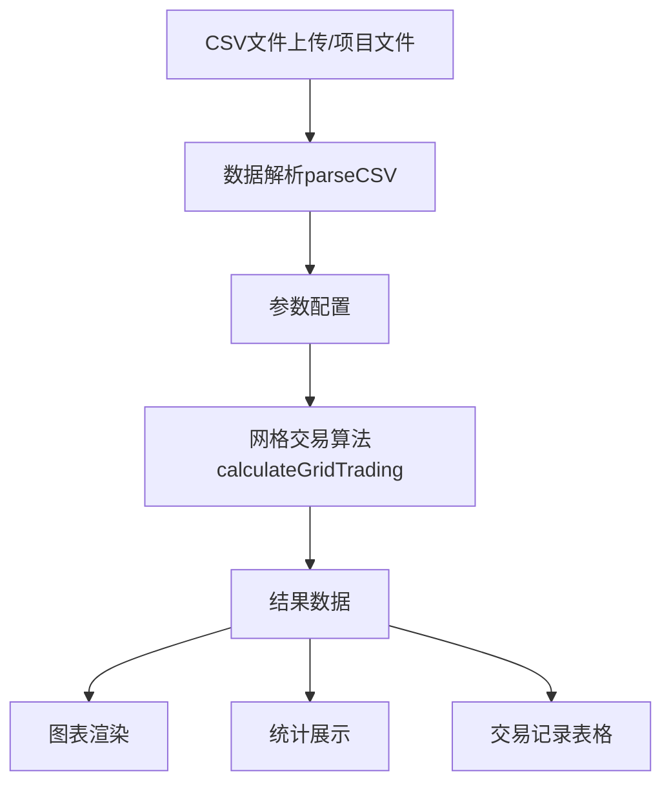

# GridTradingAnalyzer.vue 组件文档

## 📋 概述

GridTradingAnalyzer是一个功能完整的网格交易策略分析组件，提供CSV数据上传、参数配置、策略回测和结果可视化功能。该组件使用Vue.js开发，集成Chart.js进行图表渲染。

## 🏗️ 组件架构

### 核心功能模块
```
GridTradingAnalyzer
├── 数据管理模块 (Data Management)
├── 参数配置模块 (Parameter Configuration)  
├── 算法计算模块 (Trading Algorithm)
├── 图表渲染模块 (Chart Rendering)
└── UI交互模块 (User Interface)
```

## 📊 数据流图



## 🔧 技术栈

- **Vue.js 3** - 主框架
- **Chart.js** - 图表库
- **CSS Grid/Flexbox** - 布局
- **JavaScript ES6+** - 业务逻辑

## 📁 文件结构

```
GridTradingAnalyzer.vue
├── <template>          # UI模板
│   ├── 顶部配置区域
│   ├── 高级参数区域  
│   ├── 结果展示区域
│   └── 模态框
├── <script>            # 业务逻辑
│   ├── 数据管理
│   ├── 算法计算
│   ├── 图表渲染
│   └── 工具方法
└── <style>             # 样式定义
```

## 🎯 核心功能

### 1. 数据管理 (Data Management)

#### 数据来源
- **文件上传**: 用户本地CSV文件上传
- **项目文件**: 预设的项目文件(600585历史数据.csv, sample.csv)

#### 关键方法
```javascript
// CSV数据解析
parseCSV(content)           // 解析CSV内容为JSON格式
handleFileUpload(event)     // 处理文件上传事件
loadProjectFile()           // 加载项目预设文件
generateSampleData()        // 生成示例数据
```

#### 数据格式要求
```csv
"日期","收盘","开盘","高","低","交易量","涨跌幅"
"2023-01-01","25.50","25.20","25.80","25.10","15.5M","1.2%"
```

### 2. 参数配置 (Parameter Configuration)

#### 基础配置
```javascript
parameters: {
  // 资金配置
  initialCapital: 10,        // 初始资金(万元)
  basePositionRatio: 20,     // 底仓比例(%)
  singleTradeRatio: 10,      // 单次交易比例(%)
  maxPositionRatio: 70,      // 最大持仓比例(%)
  
  // 网格配置  
  gridLevels: 20,           // 网格层数
  gridDensity: 2.0,         // 网格密度(%)
  dynamicGrid: false,       // 动态网格调整
  gridResetThreshold: 15,   // 网格重置阈值(%)
  
  // 时间配置
  basePositionMode: 'days', // 建仓模式: 'days'|'date'
  basePositionDays: 5,      // 第N天建仓
  basePositionDate: '',     // 指定建仓日期
  
  // 风险控制
  stopLossRatio: 0,         // 止损比例(%)
  takeProfitRatio: 0,       // 止盈比例(%)
  maxDrawdownLimit: 0,      // 最大回撤限制(%)
  bearMarketProtection: false, // 熊市保护
  bearMarketDays: 7,        // 连续下跌天数阈值
  
  // 其他
  feeRate: 0.1,            // 手续费率(%)
  priceRangeMode: 'auto'   // 价格区间模式
}
```

### 3. 网格交易算法 (Trading Algorithm)

#### 核心算法: `calculateGridTrading()`

**算法流程:**
1. **数据预处理**: 价格数据反转、时间范围计算
2. **网格生成**: 根据价格区间和密度生成网格线
3. **底仓建立**: 在指定时间建立底仓
4. **网格交易**: 价格触发网格线时执行买卖
5. **风险控制**: 止损、止盈、回撤控制
6. **结果统计**: 计算收益、回撤等指标

**关键逻辑:**
```javascript
// 网格交易核心逻辑
for (let j = 0; j < gridLines.length - 1; j++) {
  const lowerGrid = gridLines[j]
  const upperGrid = gridLines[j + 1]
  
  // 价格下穿买入
  if (lastPrice > lowerGrid && currentPrice <= lowerGrid) {
    // 买入逻辑
  }
  
  // 价格上穿卖出  
  if (lastPrice < upperGrid && currentPrice >= upperGrid) {
    // 卖出逻辑
  }
}
```

#### 算法返回数据
```javascript
return {
  // 基础指标
  annualReturn: '6.07',          // 年化收益率(%)
  totalProfit: '5688.83',        // 总收益(元)
  maxDrawdown: '6.50',           // 最大回撤(%)
  tradeCount: 38,                // 交易次数
  sharpeRatio: '0.29',           // 夏普比率
  
  // 价格指标
  basePositionPrice: 25.50,      // 底仓建仓价
  periodHighPrice: 28.90,        // 期间最高价
  periodLowPrice: 22.10,         // 期间最低价
  
  // 历史数据
  profitHistory: [...],          // 收益历史
  drawdownHistory: [...],        // 回撤历史  
  tradeHistory: [...],           // 交易记录
  gridLines: [...],              // 网格线数据
  prices: [...],                 // 价格数据
  dates: [...]                   // 日期数据
}
```

### 4. 图表渲染 (Chart Rendering)

#### 图表类型
1. **累计收益曲线** (`renderProfitChart`)
2. **价格与网格线** (`renderGridChart`)  
3. **回撤分析** (`renderDrawdownChart`)
4. **资金分布图** (`renderAllocationChart`)

#### Chart.js配置模板
```javascript
// 基础图表配置
const chartConfig = {
  type: 'line',
  data: {
    labels: [...],
    datasets: [{
      label: '数据标签',
      data: [...],
      borderColor: '#4CAF50',
      backgroundColor: 'rgba(76, 175, 80, 0.1)',
      fill: true,
      tension: 0.4
    }]
  },
  options: {
    responsive: true,
    maintainAspectRatio: false,
    // 插件配置
    plugins: {
      legend: { position: 'top' },
      filler: { propagate: false }
    },
    // 坐标轴配置
    scales: {
      y: { beginAtZero: true },
      x: { grid: { color: '#f0f0f0' } }
    }
  }
}
```

#### 详情模态框
- **功能**: 点击"查看详情"按钮弹出大图
- **实现**: `showChartDetail(type)` + `renderDetailChart(type)`
- **支持**: 所有4种图表类型

### 5. UI组件设计

#### 响应式布局
```css
/* 桌面端 */
.main-content {
  display: grid;
  grid-template-columns: 280px 1fr;  /* 左侧参数 + 右侧结果 */
}

/* 移动端 */
@media (max-width: 1200px) {
  .main-content {
    grid-template-columns: 1fr;      /* 单列布局 */
  }
}
```

#### 配置卡片布局
```css
.config-cards-row {
  display: grid;
  grid-template-columns: repeat(auto-fit, minmax(250px, 1fr));
  gap: 15px;
}
```

## 🔍 关键方法详解

### 数据处理方法

#### `parseCSV(content)`
```javascript
// 功能: 解析CSV内容为JSON数组
// 输入: CSV文本内容
// 输出: 包含行对象的数组
// 注意: 处理引号、空行、格式验证
```

#### `getBasePositionIndex()`
```javascript
// 功能: 计算建仓时间对应的数据索引
// 支持: 按天数('days')或指定日期('date')模式
// 返回: 数组索引值
```

### 算法计算方法

#### `generateGridLines(minPrice, maxPrice, levels, density)`
```javascript
// 功能: 生成网格线价格数组
// 算法: (价格区间 * 密度 / 100) / 层数 = 网格步长
// 返回: 等差数列的价格点数组
```

#### `calculateWinRate(tradeHistory)`
```javascript
// 功能: 计算交易胜率
// 逻辑: 卖出价 > 最近买入价 = 盈利交易
// 返回: 胜率百分比
```

#### `calculateSharpeRatio(profitHistory)`
```javascript
// 功能: 计算夏普比率(风险调整后收益)
// 公式: (平均收益 / 收益波动率) * √252
// 用途: 衡量策略风险收益比
```

### 图表渲染方法

#### `renderCharts()`
```javascript
// 功能: 主图表渲染入口
// 流程: 数据验证 → 依次渲染4个图表 → 错误处理
// 时机: $nextTick + setTimeout确保DOM就绪
```

#### Chart.js错误处理
```javascript
// 常见问题及解决方案:
// 1. Canvas元素未找到 → 添加元素存在检查
// 2. Context获取失败 → 添加上下文检查  
// 3. 图表实例冲突 → 销毁旧实例再创建
// 4. 异步渲染问题 → 使用$nextTick + setTimeout
```

## 🎨 样式系统

### CSS架构
```scss
// 组件根样式
.grid-trading-analyzer {
  // 全局布局和主题
}

// 功能区域样式
.top-config-section      // 顶部配置区
.main-content            // 主要内容区
.results-section         // 结果展示区
.modal-overlay           // 模态框

// 组件样式
.config-card            // 配置卡片
.metric-card            // 指标卡片  
.chart-card             // 图表卡片
.trades-table           // 交易表格
```

### 主题配色
```css
:root {
  --primary-color: #4CAF50;      /* 主色调 - 绿色 */
  --secondary-color: #2196F3;    /* 辅助色 - 蓝色 */
  --warning-color: #FF9800;      /* 警告色 - 橙色 */
  --danger-color: #F44336;       /* 危险色 - 红色 */
  --background: #667eea;         /* 背景渐变 */
}
```

## 🔧 开发指南

### 添加新参数
1. **在`data.parameters`中定义默认值**
2. **在模板中添加UI控件**
3. **在`calculateGridTrading`中实现逻辑**
4. **更新参数说明文档**

### 添加新图表
1. **创建渲染方法** `renderXxxChart()`
2. **在`charts`对象中添加引用**
3. **在`renderCharts`中调用**
4. **添加详情模态框支持**
5. **在模板中添加canvas元素**

### 添加新指标
1. **在算法中计算指标值**
2. **在返回对象中添加字段**  
3. **在UI中添加展示卡片**
4. **更新相关计算方法**

## 🐛 常见问题排查

### 图表渲染问题
```javascript
// 问题: Cannot read properties of null (reading 'save')
// 原因: Canvas元素未就绪或Context获取失败
// 解决: 添加元素检查 + 延迟渲染

if (!this.$refs.chartName) return
const ctx = this.$refs.chartName.getContext('2d')
if (!ctx) return
```

### 数据解析问题
```javascript
// 问题: CSV解析失败
// 检查: 文件编码(UTF-8)、分隔符(逗号)、引号处理
// 调试: console.log(headers, values)查看解析结果
```

### 算法计算问题
```javascript
// 问题: 交易逻辑异常
// 检查: 数组越界、价格数据有效性、索引计算
// 调试: 在交易触发点添加日志输出
```

## 📈 性能优化

### 数据处理优化
- **大文件处理**: 考虑分块读取和Web Workers
- **内存管理**: 及时清理大数组和图表实例
- **计算优化**: 缓存重复计算结果

### 图表渲染优化  
- **延迟加载**: 使用$nextTick + setTimeout
- **实例管理**: 销毁旧图表避免内存泄漏
- **数据采样**: 大数据集时考虑降采样

### UI响应优化
- **防抖处理**: 参数变化时避免频繁重计算
- **异步渲染**: 耗时操作显示loading状态
- **虚拟滚动**: 交易记录表格考虑虚拟化

## 🔄 组件生命周期

```javascript
// 创建阶段
data() → 初始化参数和状态

// 挂载阶段  
mounted() → 无特殊处理

// 更新阶段
watch: {
  'parameters.dataSource'() → 清空数据
  'parameters.basePositionMode'() → 强制更新显示
}

// 销毁阶段
beforeUnmount() → 清理Chart.js实例
```

## 📋 测试建议

### 单元测试
- **数据解析**: 测试各种CSV格式
- **算法计算**: 验证交易逻辑正确性
- **工具方法**: 测试日期、价格计算方法

### 集成测试  
- **完整流程**: 上传→配置→分析→展示
- **边界条件**: 极端参数值、空数据处理
- **错误处理**: 文件格式错误、网络异常

### 用户体验测试
- **响应式**: 不同屏幕尺寸下的布局
- **交互性**: 参数变更的实时反馈
- **性能**: 大数据文件的处理速度

## 🔮 未来扩展方向

### 算法扩展
- **多策略支持**: ETF交易、定投策略
- **高级指标**: MACD、RSI技术指标集成
- **组合优化**: 多股票组合网格策略

### 功能增强
- **数据源扩展**: API接口、数据库连接
- **报告导出**: PDF报告、Excel数据导出
- **历史回测**: 多时间段对比分析

### 技术升级
- **TypeScript**: 添加类型安全
- **Composition API**: 重构为组合式API  
- **Worker线程**: 复杂计算后台处理

---

## 📞 维护联系

如需技术支持或功能改进建议，请联系开发团队。

**文档版本**: v1.0  
**最后更新**: 2024年1月  
**维护者**: 开发团队