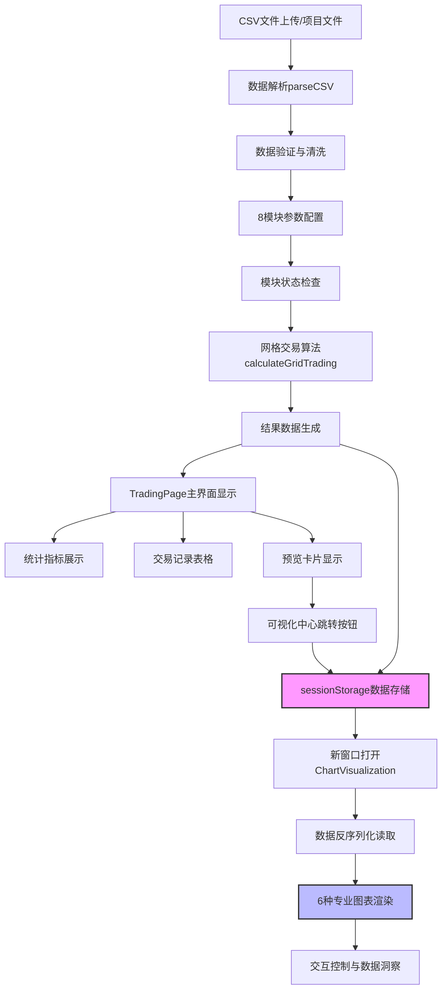

# TradingPage 网格交易策略分析系统

## 📋 系统概述

TradingPage是一个专业的量化交易回测平台，专注于网格交易策略的分析和优化。该系统通过历史数据回测，帮助用户评估不同参数配置下的网格交易策略效果，为投资决策提供数据支持。

---

# 📖 用户使用手册（开发者和AI可以不看）

*本部分面向甲方、投资者、分析师等用户*

## 🎯 产品特色

### ✨ 核心优势

1. **📊 多数据源支持**
   - 支持本地CSV文件上传，灵活导入任意股票数据
   - 内置项目数据文件：海螺水泥(600585)、苏泊尔(002032)、东方财富(700001)
   - 智能数据格式兼容，自动适配不同CSV结构

2. **⚙️ 专业参数配置**
   - **资金管理**：初始资金、底仓比例、单次交易比例、最大持仓比例
   - **网格策略**：网格层数、宽度模式(百分比/数值)、密度配置
   - **建仓策略**：按天数或指定日期建仓，灵活时机选择
   - **风险控制**：止损止盈、回撤限制、熊市保护机制

3. **🧠 智能算法引擎**
   - 完整的网格交易逻辑模拟
   - 智能底仓建立策略
   - 熊市保护功能，避免逆势加仓
   - 完善的风险控制体系

4. **📈 专业可视化分析**
   - 累计收益曲线：直观展示策略表现
   - 价格与网格线：查看价格与网格触发关系
   - 回撤分析图：评估策略风险特征
   - 资金分布图：监控现金与持仓变化

5. **📋 详细交易记录**
   - 完整的交易历史表格
   - 买卖操作可视化标识
   - 实时资金和持仓状态跟踪

## 🔗 系统访问

### 主要访问路径
- **交易分析页面**: `http://localhost:8080/trading-page`
  - 适用场景: 独立分析使用
  - 包含: 参数配置、算法分析、基础结果展示

- **可视化分析中心**: `http://localhost:8080/chart-visualization`
  - 适用场景: 专业图表分析
  - 包含: 6种大尺寸图表、交互控制、数据洞察
  - 访问方式: 通过分析页面的"进入可视化分析中心"按钮跳转

### 学习演示路径 (v3.0 新增)
- **Vue数据传递演示**: `http://localhost:8080/data-transfer-demo`
  - 适用场景: 学习Vue组件通信
  - 包含: 7种数据传递方式完整演示

### 集成访问 (已废弃)
- ~~**URL**: `http://localhost:8080/main/trading-new`~~
- ~~**适用场景**: 从主系统跳转~~

## 🚀 操作指南

### 第一步：选择数据源

#### 方式一：使用项目数据
1. 选择"项目文件"选项
2. 从下拉菜单选择股票：
   - 海螺水泥 (600585) - 1345条记录
   - 苏泊尔 (002032) - 1361条记录  
   - 东方财富 (700001) - 1353条记录
3. 系统自动显示数据量和股票信息

#### 方式二：上传本地文件
1. 选择"本地文件上传"选项
2. 点击上传区域选择CSV文件
3. 支持的数据格式：
   ```csv
   "日期","收盘","开盘","高","低","涨跌幅"
   "2024-01-01","25.50","25.20","25.80","25.10","1.2%"
   ```
   **注意**: "交易量"列为可选，系统只使用"日期"和"收盘"进行分析

### 第二步：配置交易参数

#### 资金配置
- **初始资金**: 设置起始投资金额(万元)，建议10-100万
- **底仓比例**: 建仓时买入的基础仓位比例，建议10-30%
- **单次交易比例**: 每次网格触发的交易金额比例，建议5-15%
- **最大持仓比例**: 防止过度集中的持仓上限，建议50-80%

#### 网格配置
- **网格层数**: 将价格区间分割的层数，建议10-30层
- **网格宽度模式**: 
  - **百分比模式**: 设置密度如2%、4%、6%，适合不同价位股票
  - **数值模式**: 设置固定间距如48元、50元、52元，精确控制

#### 建仓配置
- **按天数建仓**: 从最早日期向后第N天建仓
- **指定日期建仓**: 选择具体的建仓日期

#### 风险控制
- **止损比例**: 触发强制止损的亏损比例，0表示不止损
- **止盈比例**: 触发获利了结的收益比例，0表示不止盈
- **最大回撤限制**: 总体回撤控制，0表示无限制
- **熊市保护**: 连续下跌期间暂停买入，避免逆势加仓
- **手续费率**: 交易成本设置，建议0.1-0.3%

### 第三步：执行分析

点击"🚀 开始分析"按钮，系统将：
1. 加载并验证数据源
2. 根据参数生成网格线
3. 模拟完整交易过程
4. 计算收益和风险指标
5. 生成可视化图表和交易记录

## 📊 结果分析

### 核心指标解读

- **年化收益率**: 策略的年化投资回报率，用于评估盈利能力
- **总收益**: 整个回测期间的绝对收益金额
- **最大回撤**: 期间最大的资产回撤比例，评估风险水平
- **交易次数**: 总的买入和卖出操作次数，反映策略活跃度
- **夏普比率**: 风险调整后的收益指标，数值越高越好
- **胜率**: 盈利交易占总交易的比例，反映策略稳定性

### 图表分析技巧

#### 累计收益曲线
- 观察收益趋势的平滑度
- 关注收益曲线的斜率变化
- 识别收益加速或减缓的时期

#### 价格与网格线
- 查看价格波动与网格密度匹配程度
- 观察网格触发的频率和分布
- 评估网格设置的合理性

#### 回撤分析
- 关注最大回撤的持续时间
- 观察回撤恢复的速度
- 评估风险承受能力匹配度

#### 资金分布
- 监控现金与持仓的平衡
- 观察资金使用效率
- 评估流动性管理效果

### 交易记录审查

系统显示最近20笔交易的详细信息：
- **交易时机**: 买卖操作的时间点选择
- **价格执行**: 成交价格与市场价格对比
- **资金效率**: 交易金额与手续费的比例
- **持仓变化**: 交易后的资金和持仓状态

## 📱 使用环境

### 设备兼容性
- **桌面端**: 完整功能体验，推荐使用
- **平板端**: 良好的触控体验
- **移动端**: 基础功能查看

### 浏览器支持
- Chrome、Firefox、Safari、Edge最新版本
- 需要支持Canvas和现代JavaScript特性

### 性能要求
- **数据量**: 支持1000+条历史数据分析
- **响应时间**: 一般1-3秒完成分析
- **内存使用**: 建议8GB以上系统内存

## 💡 使用建议

### 新手入门
1. 先使用项目预设数据体验功能
2. 使用默认参数配置进行首次分析
3. 观察不同参数对结果的影响

### 进阶使用
1. 尝试不同的网格密度设置
2. 对比百分比模式和数值模式
3. 测试不同的建仓时机选择

### 专家优化
1. 上传多只股票数据进行对比
2. 精细调整风险控制参数
3. 分析季节性和周期性规律

## 🔧 常见问题

### Q: 为什么图表不显示？
**A**: 请确保浏览器支持Canvas，清除缓存后重新加载页面。

### Q: 如何选择合适的网格密度？
**A**: 建议先使用2-4%的密度，根据股票价格波动特性调整。

### Q: 熊市保护什么时候生效？
**A**: 当股价连续下跌超过设定天数时，系统自动暂停买入操作。

### Q: 数据上传失败怎么办？
**A**: 检查CSV格式，确保包含"日期"和"收盘"列，文件编码为UTF-8。

---

# 🛠️ 开发技术文档（开发者和AI要看）

*本部分面向开发团队、架构师、维护人员*

## 🏗️ 系统架构

### 技术栈

- **前端框架**: Vue.js 3 (Composition API)
- **图表库**: Chart.js (响应式图表渲染)
- **样式系统**: CSS Grid + Flexbox + 自定义主题
- **构建工具**: Vue CLI / Vite
- **语言**: JavaScript ES6+ (计划迁移TypeScript)

### 组件架构 (v3.0 模块化升级)

```
trading/
├── TradingPage.vue (主分析组件)
│   ├── 数据管理模块 (Data Management)
│   │   ├── CSV解析引擎
│   │   ├── 项目文件加载
│   │   └── 数据验证与清洗
│   ├── 参数配置模块 (8模块系统)
│   │   ├── 必需模块×4: 数据源、资金、网格、建仓
│   │   ├── 可选模块×4: 风险控制、高级策略、市场环境、资金管理
│   │   ├── 模块状态管理 (moduleStates)
│   │   └── 条件性算法执行
│   ├── 算法计算模块 (Trading Algorithm)
│   │   ├── 网格生成算法 (双模式支持)
│   │   ├── 交易逻辑引擎
│   │   ├── 模块化风险控制系统
│   │   └── 指标计算模块
│   ├── 数据传递模块 (Data Transfer)
│   │   ├── sessionStorage序列化存储
│   │   ├── 分析结果完整传递
│   │   ├── 新窗口跳转控制
│   │   └── 容错处理机制
│   └── UI交互模块 (User Interface)
│       ├── 8模块配置界面
│       ├── 预览卡片设计
│       ├── 可视化入口按钮
│       └── 响应式布局系统
│
└── ChartVisualization.vue (专业可视化组件)
    ├── 数据获取模块 (Data Acquisition)
    │   ├── sessionStorage数据读取
    │   ├── props数据接收 (双模式支持)
    │   ├── 数据完整性验证
    │   └── 实时数据计算
    ├── 图表渲染系统 (Chart System)
    │   ├── 6种专业图表渲染
    │   ├── Chart.js深度集成
    │   ├── 大尺寸图表优化
    │   └── 全屏模式支持
    ├── 交互控制模块 (Interaction Control)
    │   ├── 图表类型切换
    │   ├── 网格线显示控制
    │   ├── 数据洞察面板
    │   └── 实时监控系统
    └── 导航管理模块 (Navigation)
        ├── 返回分析页面
        ├── 图表导出功能 (预留)
        ├── 全屏模态框管理
        └── 用户引导系统
```

### 数据流架构 (v3.0 双组件模式)



## 🔧 核心算法实现

### v3.0 模块化参数系统

```javascript
// v3.0 新增：模块状态管理
moduleStates: {
  riskControl: false,        // 风险控制模块
  advancedStrategy: false,   // 高级策略模块  
  marketEnvironment: false,  // 市场环境模块
  fundManagement: false      // 资金管理模块
}

// v3.0 扩展参数结构
parameters: {
  // ... 现有参数 ...
  
  // 高级策略模块参数 (占位)
  advancedStrategy: {
    enableDynamicGrid: false,
    trendSensitivity: 50,
    volatilityThreshold: 2.0
  },
  
  // 市场环境模块参数 (占位)  
  marketEnvironment: {
    sectorRotation: false,
    marketSentiment: 'neutral',
    macroFactor: 1.0
  },
  
  // 资金管理模块参数 (占位)
  fundManagement: {
    batchBuilding: false,
    dynamicPosition: false,
    riskBudget: 10
  }
}
```

### v3.0 数据传递系统

```javascript
// TradingPage中的数据传递实现
openVisualizationCenter() {
  if (this.analysisResults) {
    // 序列化完整分析结果
    sessionStorage.setItem('tradingAnalysisResults', JSON.stringify(this.analysisResults))
    // 新窗口打开可视化页面
    window.open('/chart-visualization', '_blank')
  } else {
    alert('请先完成分析后再查看可视化图表')
  }
}

// ChartVisualization中的数据获取
computed: {
  currentAnalysisResults() {
    // 双模式支持：props优先，sessionStorage兜底
    if (this.analysisResults) {
      return this.analysisResults
    }
    
    const storedData = sessionStorage.getItem('tradingAnalysisResults')
    if (storedData) {
      try {
        return JSON.parse(storedData)
      } catch (error) {
        console.error('解析存储的分析结果失败:', error)
        return null
      }
    }
    return null
  }
}
```

### v3.0 模块化算法执行

```javascript
// 条件性风险控制执行
if (this.moduleStates.riskControl) {
  // 手续费计算
  const feeRate = this.moduleStates.riskControl ? params.feeRate : 0
  const fee = buyAmount * feeRate / 100
  
  // 止损止盈检查
  if (params.stopLossRatio > 0 && profit < -initialCapital * params.stopLossRatio / 100) {
    console.log('触发止损:', profit)
  }
  
  // 熊市保护
  if (params.bearMarketProtection && consecutiveDownDays >= params.bearMarketDays) {
    // 暂停买入
  }
}

// 其他可选模块的算法集成点 (占位)
if (this.moduleStates.advancedStrategy) {
  // TODO: 集成高级策略算法
}

if (this.moduleStates.marketEnvironment) {
  // TODO: 集成市场环境分析
}

if (this.moduleStates.fundManagement) {
  // TODO: 集成资金管理策略
}
```

### 参数系统 (v2.0 基础)

```javascript
parameters: {
  // 数据源配置
  dataSource: 'project',           // 'upload' | 'project'
  selectedProjectFile: '600585',   // 当前选择的项目文件
  
  // 资金配置
  initialCapital: 10,              // 初始资金(万元)
  basePositionRatio: 20,           // 底仓比例(%)
  singleTradeRatio: 10,            // 单次交易比例(%)
  maxPositionRatio: 70,            // 最大持仓比例(%)
  
  // 网格配置 (v2.0 重大更新)
  gridLevels: 20,                  // 网格层数
  gridWidthMode: 'percentage',     // 网格宽度模式: 'percentage' | 'value'
  gridDensity: 2.0,               // 网格密度(%) - 百分比模式
  gridWidth: 50,                  // 网格宽度(元) - 数值模式
  
  // 时间配置
  basePositionMode: 'days',        // 建仓模式: 'days' | 'date'
  basePositionDays: 5,            // 第N天建仓
  basePositionDate: '',           // 指定建仓日期
  
  // 风险控制
  stopLossRatio: 0,               // 止损比例(%)
  takeProfitRatio: 0,             // 止盈比例(%)
  maxDrawdownLimit: 0,            // 最大回撤限制(%)
  bearMarketProtection: false,    // 熊市保护
  bearMarketDays: 7,              // 连续下跌天数阈值
  
  // 其他配置
  feeRate: 0.1,                   // 手续费率(%)
}
```

### 网格生成算法 (v2.0 双模式支持)

```javascript
// 生成网格线 - 支持两种模式
generateGridLines(minPrice, maxPrice, params) {
  let gridStep
  
  if (params.gridWidthMode === 'percentage') {
    // 百分比模式：根据价格范围和密度计算
    const priceRange = maxPrice - minPrice
    gridStep = (priceRange * params.gridDensity / 100) / params.gridLevels
  } else {
    // 数值模式：使用固定的价格间距
    gridStep = params.gridWidth
  }
  
  const gridLines = []
  for (let i = 0; i <= params.gridLevels; i++) {
    gridLines.push(minPrice + i * gridStep)
  }
  
  return gridLines
}
```

### 核心交易算法 (calculateGridTrading)

```javascript
calculateGridTrading(data) {
  // 1. 数据预处理
  const prices = data.map(row => parseFloat(row['收盘']) || 0).reverse()
  const dates = data.map(row => row['日期']).reverse()
  
  // 2. 网格生成 (v2.0 更新)
  const maxPrice = Math.max(...prices)
  const minPrice = Math.min(...prices)
  const gridLines = this.generateGridLines(minPrice, maxPrice, params)
  
  // 3. 交易模拟主循环
  for (let i = 0; i < prices.length; i++) {
    const currentPrice = prices[i]
    const currentDate = dates[i]
    
    // 底仓建立逻辑
    if (i === basePositionIndex && params.basePositionRatio > 0) {
      this.establishBasePosition(currentPrice, currentDate)
    }
    
    // 熊市保护检查
    if (i > 0 && params.bearMarketProtection) {
      this.updateBearMarketStatus(prices, i)
    }
    
    // 网格交易核心逻辑
    if (i > 0 && !traded) {
      this.executeGridTrading(prices, i, gridLines)
    }
    
    // 风险控制检查
    this.checkRiskLimits(currentValue, initialCapital, params)
    
    // 记录历史数据
    this.recordTradingHistory(currentDate, currentPrice, currentValue)
  }
  
  // 4. 指标计算与结果返回
  return this.calculateFinalResults()
}
```

### 数据管理系统 (v2.0 增强容错)

```javascript
// CSV解析 - 增强容错性
parseCSV(content) {
  try {
    const lines = content.split('\n').filter(line => line.trim())
    const headers = lines[0].split(',').map(h => h.replace(/"/g, '').trim())
    
    const data = []
    for (let i = 1; i < lines.length; i++) {
      const values = lines[i].split(',').map(v => v.replace(/"/g, '').trim())
      
      // v2.0: 容忍列数不完全匹配的情况
      if (values.length >= 2 && values.length <= headers.length + 2) {
        const row = {}
        headers.forEach((header, index) => {
          row[header] = index < values.length ? values[index] : ''
        })
        
        // 确保必需的列存在
        if (row['日期'] && row['收盘']) {
          data.push(row)
        }
      }
    }
    
    this.csvData = data
    console.log('CSV数据解析完成:', data.length, '条记录')
  } catch (error) {
    console.error('CSV解析错误:', error)
    alert('CSV文件解析失败，请检查文件格式')
  }
}

// 项目文件配置 (v2.0 新增700001)
projectDataInfo: {
  '600585': '1345',    // 海螺水泥
  '002032': '1361',    // 苏泊尔  
  '700001': '1353'     // 东方财富 (v2.0 新增)
}

getStockName(code) {
  const stockNames = {
    '600585': '海螺水泥 (600585)',
    '002032': '苏泊尔 (002032)', 
    '700001': '东方财富 (700001)'  // v2.0 新增
  }
  return stockNames[code] || code
}
```

### v3.0 专业可视化系统 (ChartVisualization.vue)

```javascript
// v3.0 扩展图表管理对象
charts: {
  profit: null,        // 累计收益曲线
  grid: null,          // 价格与网格线
  drawdown: null,      // 回撤分析
  allocation: null,    // 资金分布
  frequency: null,     // 交易频率分析 (新增)
  distribution: null,  // 收益分布分析 (新增)
  fullscreen: null     // 全屏详情图表
}

// v3.0 图表交互控制
chartTypes: {
  profit: 'line',      // 支持线性/柱状切换
  grid: 'line'
},
showGridLines: true,   // 网格线显示控制
showTradePoints: true, // 交易点位显示控制

// v3.0 专业数据洞察计算
computed: {
  maxProfit() {
    const profits = this.currentAnalysisResults.profitHistory?.map(p => p.profit)
    return Math.max(...profits).toFixed(2)
  },
  
  gridTriggerCount() {
    return this.currentAnalysisResults.tradeHistory?.filter(t => 
      t.reason?.includes('网格')).length
  },
  
  gridEfficiency() {
    const total = this.currentAnalysisResults?.tradeCount || 0
    const gridTrades = this.gridTriggerCount
    return total > 0 ? (gridTrades / total * 100).toFixed(1) : '0.0'
  }
}
```

### v3.0 全屏图表系统

```javascript
// 全屏图表管理
openFullscreenChart(chartType) {
  this.fullscreenChart = chartType
  this.fullscreenTitle = this.getChartTitle(chartType)
  this.$nextTick(() => {
    this.renderFullscreenChart(chartType)
  })
}

// 动态图表配置复制
renderFullscreenChart(chartType) {
  const sourceChart = this.charts[chartType]
  if (sourceChart) {
    this.charts.fullscreen = new Chart(ctx, {
      type: sourceChart.config.type,
      data: JSON.parse(JSON.stringify(sourceChart.data)),
      options: {
        ...sourceChart.options,
        responsive: true,
        maintainAspectRatio: false
      }
    })
  }
}
```

### 图表渲染系统 (v2.0 基础)

```javascript
// 图表管理对象
charts: {
  profit: null,      // 累计收益曲线
  grid: null,        // 价格与网格线
  drawdown: null,    // 回撤分析
  allocation: null,  // 资金分布
  detail: null       // 详情模态框
}

// 主渲染方法
renderCharts() {
  try {
    this.renderProfitChart()     // 收益曲线
    this.renderGridChart()       // 网格线图
    this.renderDrawdownChart()   // 回撤分析
    this.renderAllocationChart() // 资金分布
  } catch (error) {
    console.error('图表渲染错误:', error)
  }
}

// Chart.js配置模板
createChartConfig(type, data, options = {}) {
  return {
    type: type,
    data: data,
    options: {
      responsive: true,
      maintainAspectRatio: false,
      plugins: {
        legend: { position: 'top' },
        filler: { propagate: false }
      },
      scales: {
        y: { 
          beginAtZero: true,
          grid: { color: '#f0f0f0' }
        },
        x: { 
          grid: { color: '#f0f0f0' }
        }
      },
      ...options
    }
  }
}
```

### 响应式计算属性

```javascript
computed: {
  // 数据有效性检查
  hasValidData() {
    if (this.parameters.dataSource === 'upload') {
      return this.csvData && this.csvData.length > 0
    }
    return true // 项目文件总是有效的
  },
  
  // 动态数据量显示 (v2.0 实时计算)
  actualDataCount() {
    if (this.parameters.dataSource === 'upload') {
      return this.csvData ? this.csvData.length : '未上传'
    } else if (this.parameters.dataSource === 'project') {
      if (this.csvData && this.csvData.length > 0) {
        return this.csvData.length  // 显示实际加载的数据量
      }
      // 如果数据还未加载，显示预估值
      return this.projectDataInfo[this.parameters.selectedProjectFile] || '加载中...'
    }
    return '未知'
  }
}
```

## 🎨 优雅主题系统

### CSS架构设计

```scss
// 主题变量系统
:root {
  --primary: #1a1a1a;           // 深黑色 - 主色
  --secondary: #f8f5f2;         // 米黄色 - 背景主色
  --accent: #d4b8a0;            // 米色 - 强调色
  --text: #333333;              // 文本主色
  --light-text: #777777;        // 浅色文本
  
  --success-color: #4CAF50;     // 成功色
  --warning-color: #FF9800;     // 警告色
  --danger-color: #F44336;      // 危险色
  
  --border-radius: 12px;        // 统一圆角
  --card-shadow: 0 8px 32px rgba(0,0,0,0.1);
  --transition: all 0.3s cubic-bezier(0.25, 0.1, 0.25, 1);
}

// 组件架构
.grid-trading-analyzer {
  background-color: var(--secondary);
  font-family: 'Montserrat', sans-serif;
  
  // 顶级容器
  .top-config-section {
    background: var(--bg-primary);
    backdrop-filter: blur(10px);
  }
  
  .main-content {
    background: var(--bg-primary);
    backdrop-filter: blur(10px);
  }
  
  // 卡片系统
  .config-card {
    background: var(--bg-secondary);
    backdrop-filter: blur(5px);
  }
  
  .metric-card {
    background: linear-gradient(135deg, var(--bg-secondary), var(--bg-primary));
    backdrop-filter: blur(5px);
  }
}
```

### 响应式布局系统

```scss
// 移动优先设计
.config-cards-row {
  display: grid;
  grid-template-columns: repeat(auto-fit, minmax(280px, 1fr));
  gap: 20px;
}

// 断点系统
@media (max-width: 1200px) {
  .charts-container {
    grid-template-columns: 1fr;
  }
}

@media (max-width: 768px) {
  .grid-trading-analyzer {
    padding: 15px;
  }
  
  .metrics-grid {
    grid-template-columns: 1fr;
  }
}
```

## 🔄 组件生命周期

```javascript
// Vue 3生命周期钩子
export default {
  name: 'TradingPage',
  
  // 创建阶段
  data() {
    return {
      // 响应式数据初始化
      csvData: null,
      analysisResults: null,
      parameters: { /* 默认配置 */ },
      charts: { /* 图表实例 */ }
    }
  },
  
  // 计算属性
  computed: {
    hasValidData() { /* 数据验证 */ },
    actualDataCount() { /* 动态计算 */ }
  },
  
  // 监听器
  watch: {
    'parameters.dataSource'() {
      // 切换数据源时清空结果
      this.analysisResults = null
      this.csvData = null
      this.fileName = ''
    }
  },
  
  // 销毁阶段
  beforeUnmount() {
    // 清理Chart.js实例，防止内存泄漏
    Object.values(this.charts).forEach(chart => {
      if (chart) {
        chart.destroy()
      }
    })
  }
}
```

## 📈 性能优化策略

### 数据处理优化
- **大文件处理**: CSV分块读取，避免阻塞主线程
- **内存管理**: 及时清理图表实例和大数组
- **计算缓存**: 缓存重复计算的网格线和指标

### 图表渲染优化
- **延迟渲染**: 使用`$nextTick + setTimeout`确保DOM就绪
- **实例管理**: 销毁旧图表实例避免内存泄漏
- **数据采样**: 大数据集时考虑降采样显示

### UI响应优化
- **防抖处理**: 参数变化时避免频繁重计算
- **异步渲染**: 耗时操作显示loading状态
- **响应式计算**: 使用计算属性而非方法调用

## 🔧 开发指南

### 添加新参数
1. 在`data.parameters`中定义默认值
2. 在模板中添加对应的UI控件
3. 在`calculateGridTrading`中实现相关逻辑
4. 更新参数验证和文档

### 添加新图表
1. 创建对应的渲染方法 `renderXxxChart()`
2. 在`charts`对象中添加实例引用
3. 在`renderCharts`主方法中调用
4. 添加详情模态框支持
5. 在模板中添加对应的canvas元素

### 添加新指标
1. 在算法中计算指标值
2. 在返回对象中添加字段
3. 在UI中添加展示卡片
4. 更新相关的计算方法

## 🐛 问题排查指南

### 图表渲染问题
```javascript
// 常见错误: Cannot read properties of null (reading 'save')
// 解决方案: 添加DOM元素检查
if (!this.$refs.chartName) return
const ctx = this.$refs.chartName.getContext('2d')
if (!ctx) return

// 销毁旧实例避免冲突
if (this.charts.chartName) {
  this.charts.chartName.destroy()
}
```

### 数据解析问题
```javascript
// 调试技巧
console.log('Headers:', headers)
console.log('Sample row:', values)
console.log('Parsed data:', data.slice(0, 3))

// 常见问题
// 1. 文件编码: 确保UTF-8编码
// 2. 分隔符: 检查是否为标准逗号分隔
// 3. 引号处理: 处理字段中的引号
```

### 算法计算问题
```javascript
// 在关键点添加调试日志
console.log('Price range:', minPrice, '-', maxPrice)
console.log('Grid step:', gridStep)
console.log('Trade executed:', tradeHistory.length)

// 检查数组越界
if (i >= prices.length || i < 0) {
  console.error('Array index out of bounds:', i)
  return
}
```

## 📋 测试策略

### 单元测试
- **数据解析**: 测试各种CSV格式和边界条件
- **算法计算**: 验证网格生成和交易逻辑
- **工具方法**: 测试日期计算、价格转换等

### 集成测试
- **完整流程**: 上传→配置→分析→展示的端到端测试
- **边界条件**: 极端参数值、空数据、错误数据
- **错误处理**: 文件格式错误、网络异常、内存溢出

### 用户体验测试
- **响应式**: 不同屏幕尺寸下的布局测试
- **交互性**: 参数变更的实时反馈测试
- **性能**: 大数据文件的处理速度测试

## 🔮 技术路线图

### 短期目标 (Q1-Q2)
- **TypeScript迁移**: 增加类型安全，提升代码质量
- **Composition API重构**: 更好的逻辑复用和组织
- **单元测试覆盖**: 达到80%以上测试覆盖率

### 中期目标 (Q3-Q4)
- **Web Workers**: 复杂计算后台处理
- **虚拟滚动**: 大数据表格性能优化
- **PWA支持**: 离线使用能力

### 长期目标 (Next Year)
- **微前端架构**: 模块化部署和独立更新
- **实时数据**: WebSocket集成实时行情
- **机器学习**: 参数自动优化建议

## 📊 版本更新日志

### v3.0 (当前版本) - 2024年1月
**🚀 模块化与可视化革命性更新**

#### 🎨 全新可视化分析中心
- ✅ **独立可视化组件**: 创建专门的ChartVisualization.vue组件
  - 6种专业图表：累计收益、价格网格、回撤分析、资金分布、交易频率、收益分布
  - 大尺寸图表显示，提升分析体验
  - 全屏模式支持，每个图表可独立全屏查看
  - 智能数据洞察，每个图表配备专业分析指标

- ✅ **革命性数据传递系统**: 
  - 纯前端sessionStorage数据传递，无需后端支持
  - 双模式数据获取：props传递 + sessionStorage读取
  - 自动清理机制，标签页关闭后数据自动清除
  - 完整的容错处理，确保数据传递稳定性

- ✅ **专业图表交互功能**:
  - 图表类型切换（线性/柱状）
  - 网格线显示控制
  - 交易点位标记
  - 实时数据监控面板
  - 事件日志系统

#### 🏗️ 模块化架构升级
- ✅ **组件文件夹重组**: 
  ```
  frontend/src/components/
  ├── trading/                    # 交易分析模块
  │   ├── TradingPage.vue        # 主交易页面
  │   ├── ChartVisualization.vue # 专业可视化组件
  │   └── TradingPage完整文档.md # 技术文档
  └── study/                     # 学习演示模块
      └── 数据结构传递/          # Vue数据传递教学演示
  ```

- ✅ **8个模块参数配置系统**:
  - 上排4个必需模块：数据源、资金配置、网格配置、建仓配置
  - 下排4个可选模块：风险控制、高级策略、市场环境、资金管理
  - 模块启用/禁用切换系统
  - 条件性算法执行（只有启用的模块才参与计算）

#### 📚 教学演示系统
- ✅ **Vue数据传递完整演示**:
  - DataSender.vue：演示7种数据传递方式的发送端
  - DataReceiver.vue：演示各种数据接收和处理方式
  - 包含：Props/Emit、sessionStorage、localStorage、URL参数、全局状态、Provide/Inject
  - 实时监控面板、事件日志、数据处理演示

#### 🔧 技术架构改进
- ✅ **路由系统优化**:
  - 新增`/chart-visualization`路由（可视化分析中心）
  - 新增`/data-transfer-demo`路由（数据传递演示）
  - 组件导入路径更新，支持模块化结构

- ✅ **数据流优化**:
  ```javascript
  // v3.0 数据传递流程
  TradingPage分析 → sessionStorage存储 → 新窗口打开 
  → ChartVisualization读取 → 专业图表渲染
  ```

- ✅ **模块状态管理**:
  ```javascript
  moduleStates: {
    riskControl: false,        // 风险控制模块
    advancedStrategy: false,   // 高级策略模块  
    marketEnvironment: false,  // 市场环境模块
    fundManagement: false      // 资金管理模块
  }
  ```

#### 🎯 用户体验提升
- ✅ **图表显示质量革命性提升**:
  - 从400px小图变为800px+专业大图
  - 从4种基础图表扩展为6种专业图表
  - 每个图表配备数据洞察和交互控制
  - 独立页面无干扰的分析环境

- ✅ **预览卡片设计**:
  - 替换原始小图表显示为优雅预览卡片
  - 关键统计数据一览：交易次数、分析天数、年化收益
  - 动画按钮和视觉反馈
  - 直观的功能说明和引导

#### 🔄 数据传递技术解析
```javascript
// v3.0 数据传递核心实现
openVisualizationCenter() {
  if (this.analysisResults) {
    // 关键：将整个分析结果对象序列化存储
    sessionStorage.setItem('tradingAnalysisResults', JSON.stringify(this.analysisResults))
    window.open('/chart-visualization', '_blank')
  }
}

// 可视化组件中的数据获取
computed: {
  currentAnalysisResults() {
    if (this.analysisResults) {
      return this.analysisResults  // 优先使用 props
    }
    
    // 从 sessionStorage 获取数据
    const storedData = sessionStorage.getItem('tradingAnalysisResults')
    if (storedData) {
      try {
        return JSON.parse(storedData)  // 反序列化数据
      } catch (error) {
        console.error('解析存储的分析结果失败:', error)
        return null
      }
    }
    return null
  }
}
```

#### 📊 新增图表类型
1. **交易频率分析图**: 柱状图显示每日交易分布
2. **收益分布分析图**: 饼图显示收益区间分布
3. **数据洞察面板**: 每个图表配备专业分析指标
4. **全屏查看模式**: 支持任意图表全屏分析

#### 🎓 教学价值
- ✅ **完整的Vue数据传递教学系统**
- ✅ **7种数据传递方式实战演示**
- ✅ **可视化数据流向和状态监控**
- ✅ **实时事件日志和操作反馈**
- ✅ **响应式设计和现代化界面**

### v2.0 - 2024年1月
**🎉 重大更新**

#### 新增功能
- ✅ **双模式网格宽度配置**
  - 百分比模式：基于价格波动范围设置
  - 数值模式：固定价格间距设置
- ✅ **新增东方财富(700001)数据源**
  - 支持1353条历史数据
  - 兼容缺少"交易量"列的CSV格式
- ✅ **优雅主题系统**
  - 与ElegantPortalPage风格统一
  - 毛玻璃效果和现代化设计
  - 完整的深色模式支持

#### 功能改进
- ✅ **增强CSV解析容错性**
  - 自动适配不同列数的CSV文件
  - 智能检测必需列的存在性
- ✅ **响应式数据量显示**
  - 实时计算并显示实际数据条数
  - 取消硬编码的数据量配置
- ✅ **移除冗余功能**
  - 删除"动态网格调整"选项
  - 简化参数配置界面

#### 技术优化
- ✅ **Vue运行时错误修复**
  - 移除不当的`$forceUpdate()`调用
  - 使用计算属性替代强制更新
- ✅ **代码结构优化**
  - 更清晰的方法命名和组织
  - 完善的错误处理机制

#### 样式系统
- ✅ **统一设计语言**
  - 采用优雅主题的配色方案
  - 一致的圆角、阴影和过渡效果
- ✅ **响应式增强**
  - 更好的移动端适配
  - 完善的断点设计

### v1.0 - 2023年12月
**🎯 初始版本**
- 基础网格交易策略分析功能
- CSV文件上传和解析
- 基础参数配置和图表展示
- 简单的交易记录显示

---

## 📞 维护与支持

### 开发团队联系
- **项目负责人**: 张斯涵
- **技术支持**: A07别催我们队
- **代码仓库**: [项目Git地址]

### 文档维护
- **当前版本**: v2.0
- **最后更新**: 2024年1月
- **下次评审**: 2024年3月

### 技术支持
如需技术支持或功能改进建议，请通过以下方式联系：
- 提交Issue到项目仓库
- 发送邮件到开发团队
- 参与项目技术讨论会议

---

*本文档包含完整的用户手册和技术文档，适用于所有项目相关人员。*